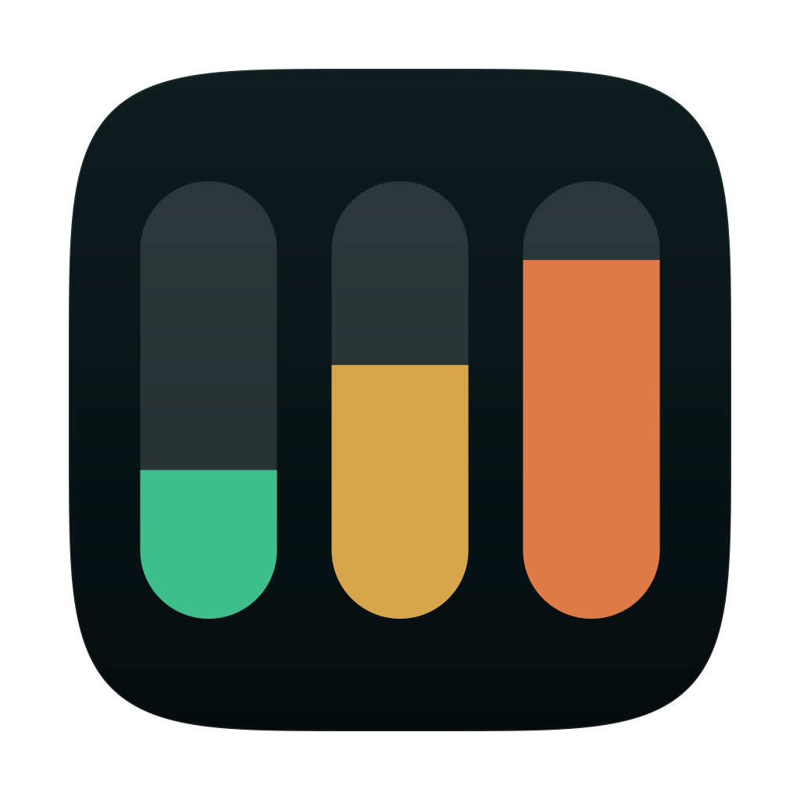
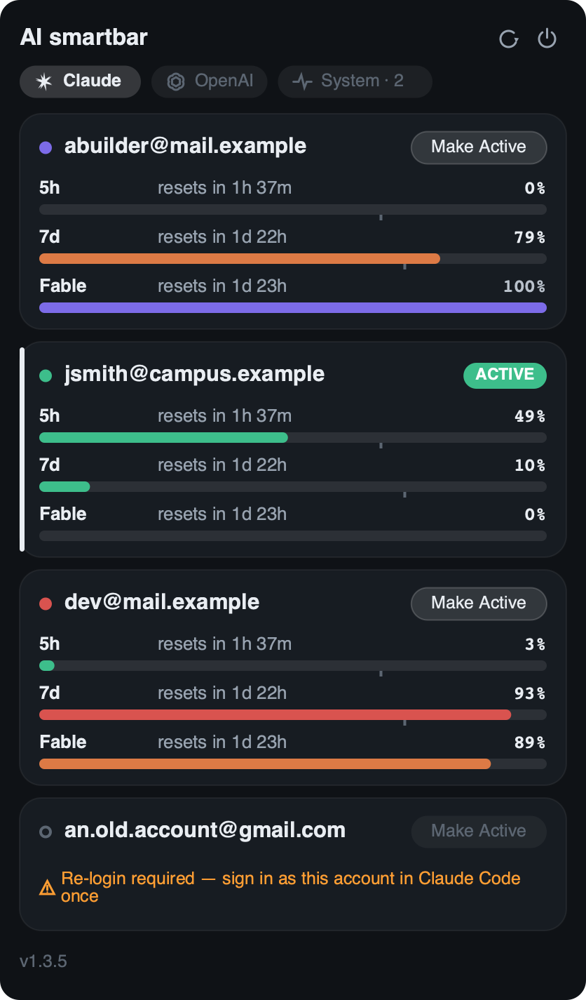
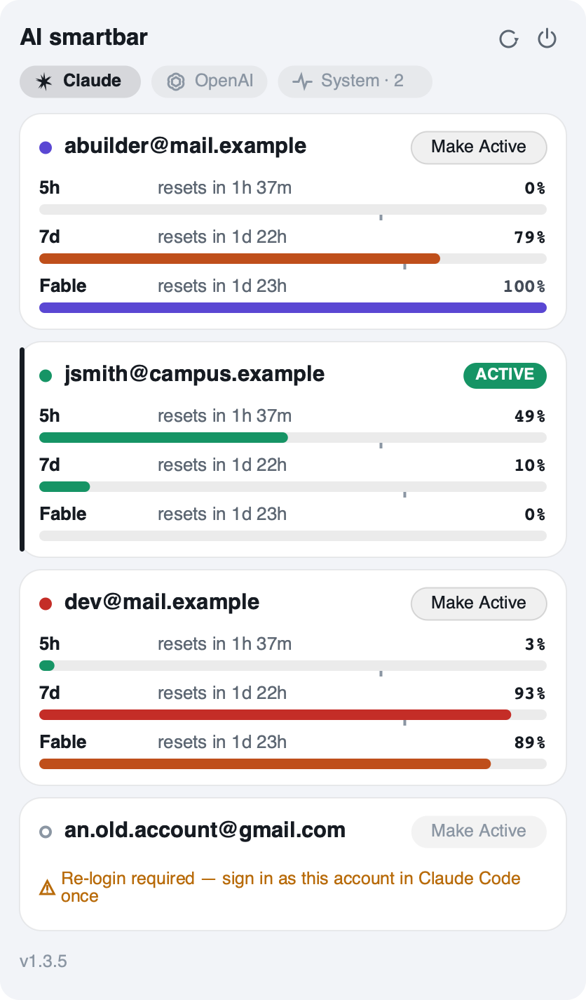
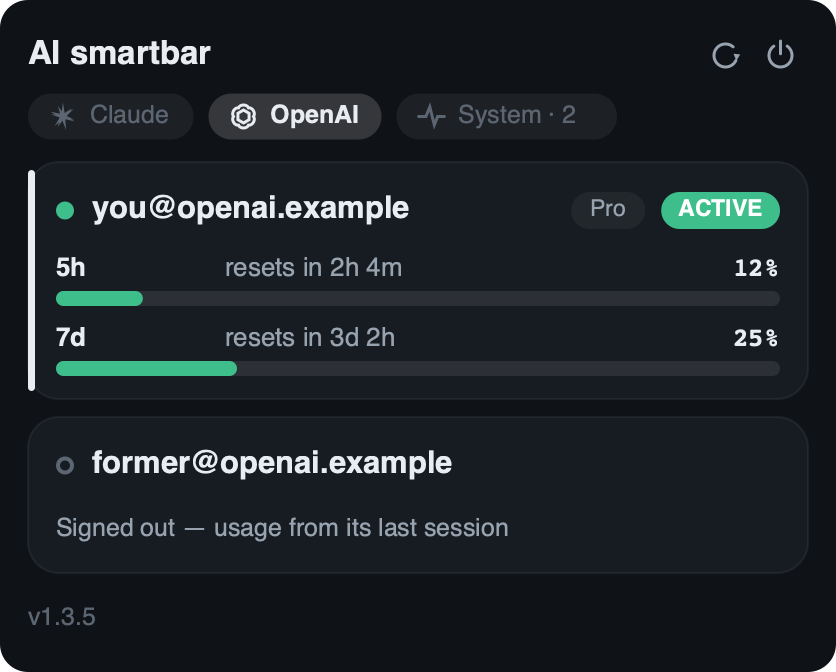
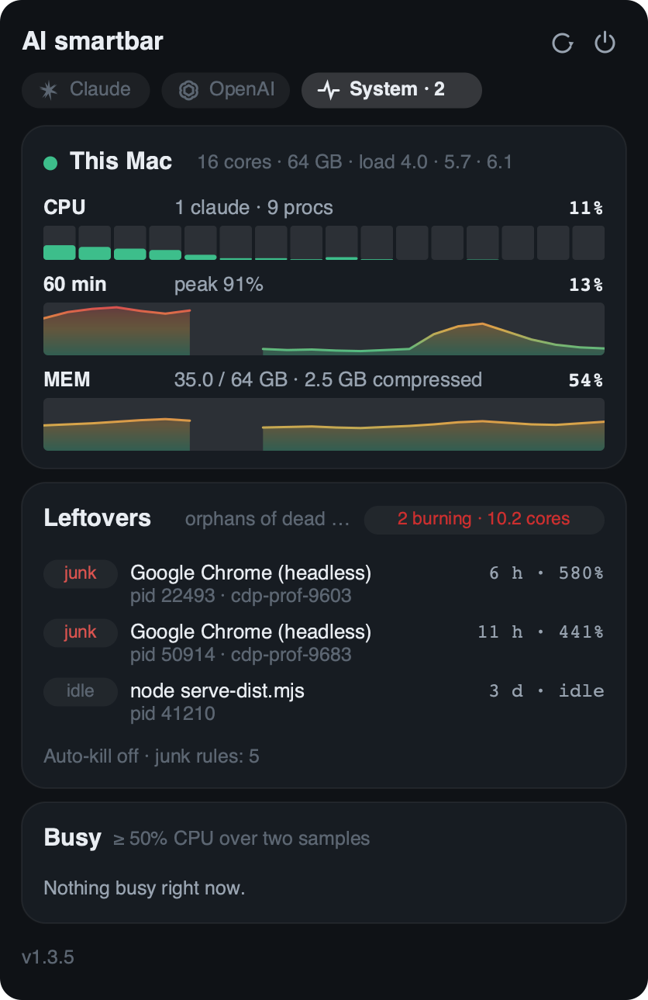

<div align="center">



# AI smartbar

### Your Claude, ChatGPT &amp; Codex usage limits — always visible in your menu bar

**See how much of your Claude (and ChatGPT / Codex) usage you've already spent,
right in the menu bar — and switch to a fresh Claude account in one click,
before you hit the wall.**

[](https://github.com/ductran27/AI_smartbar/releases)
[](https://github.com/ductran27/AI_smartbar/actions/workflows/tests.yml)
[](LICENSE)


[**Install**](#install) · [FAQ](#faq) · [Troubleshoot](#troubleshooting) · [Docs](#advanced)



</div>

## What it does

- 🔋 **Glanceable usage.** Twin-pill menu-bar icon fills as you spend, colour-coded green → yellow → red → purple. Read your limit without opening anything.
- ⚡ **One-click account switch.** `Make Active` to flip your Claude account instantly. New sessions use the new account; running ones keep theirs.
- 🤖 **Claude + ChatGPT.** Claude via [claude-swap](https://github.com/realiti4/claude-swap); ChatGPT/Codex read from Codex's own local files. Same 5-hour and weekly windows as `/usage`.
- 🖥️ **Cross-platform.** Native SwiftUI on macOS 13+; the same unit-tested panel on Linux and Windows.
- 🔒 **Local & private.** Usage from Anthropic's API (same as `/usage`) and local files. Credentials never leave your machine.

## Install

**Requirements:** [claude-swap](https://github.com/realiti4/claude-swap) for Claude accounts (`pipx install claude-swap`). Python 3 on all platforms.

```bash
git clone https://github.com/ductran27/AI_smartbar ~/tools/AI_smartbar
cd ~/tools/AI_smartbar

# macOS (native app, recommended):
./install/macos-swift.sh

# macOS (Python fallback for older Macs):
./install/macos.sh

# Linux:
./install/linux.sh

# Windows:
.\install\windows.ps1
```

That's it — the icon appears in your menu bar within a minute, and updates itself automatically. Uninstall with `--uninstall` (or `-Uninstall` on Windows).

<details>
<summary><b>More screenshots</b> — light appearance, ChatGPT tab, System tab</summary>

<br>

|  |  |
| :---: | :---: |
| **Claude · dark** | **Claude · light** |
|  |  |
| **ChatGPT / Codex** | **System tab (CPU, memory, leftover processes)** |
|  |  |

</details>

## FAQ

**Is AI smartbar free?**
Yes — Apache 2.0 open source.

**Does it read or upload my Claude credentials?**
No. It reads usage from Anthropic's own API (the one behind `/usage`) and Codex's local files. Nothing goes anywhere except to the providers' own servers.

**Do I need claude-swap?**
For Claude, yes — it handles account switching. Sign in to Claude Code once; auto-registration handles the rest. ChatGPT/Codex works with just Codex signed in.

**How is "usage" measured?**
Every percentage is "% used" on the exact scale Claude Code's `/usage` shows — no conversion, no estimates.

**Does switching interrupt my running session?**
No. The switch affects *new* sessions only; running ones keep their account.

**Which platforms are fully supported?**
The macOS app is live-tested. Linux and Windows run the same unit-tested layout — see [Platform status](advanced#platform-status) below if you're on those.

**Does polling burn through my rate limit?**
No. It polls adaptively (60s near a limit, 180s when calm) and stays within claude-swap's per-account budget. See [Data freshness](#advanced) for details.

## Troubleshooting

```bash
ai-smartbar --once          # print icon state and usage rows
ai-smartbar --check-update  # is a newer release waiting?

# Logs:
tail ~/.cache/ai-smartbar/tray.log        # Linux
tail ~/Library/Logs/ai-smartbar.log       # macOS
type %LOCALAPPDATA%\ai-smartbar\tray.log  # Windows (PowerShell)
```

**Nothing appears on Windows?** See [`docs/windows-bring-up.md`](docs/windows-bring-up.md) for the manual checklist.

**"Re-login required" on an account?** Sign in to Claude Code as that account once; the bar re-captures it automatically. See [Credential lifecycle](#advanced).

**Purple means spent** — a metric at 100% used shows purple (not dim).

---

## Advanced

All the details below are optional reading. Most users don't need to touch any of this.

<details>
<summary><b>Full contents</b></summary>

- [Platform status](#platform-status)
- [The anatomy](#the-anatomy)
- [Features deep dive](#features-deep-dive)
- [Configuration (environment variables)](#configuration-environment-variables)
- [Settings that survive an update](#settings-that-survive-an-update)
- [Device presence](#device-presence)
- [The OpenAI tab details](#the-openai-tab)
- [The System tab details](#the-system-tab)
- [The Linux panel details](#the-linux-panel)
- [Updating and releases](#updating-and-releases)
- [Credential lifecycle](#credential-lifecycle)
- [Auto window-starter (warmup)](#auto-window-starter)
- [Data freshness](#data-freshness)
- [Development](#development)

</details>

### Platform status

**macOS:** Native SwiftUI app, live-verified (v1.3.5), macOS 13+. Needs Xcode Command Line Tools for build only. Light and dark appearances both supported.

**Linux:** The same unit-tested panel painted with cairo (not GTK). Live-tested on XFCE/GNOME; should work on any distro with Python 3, GTK3 bindings, AyatanaAppIndicator3 and a StatusNotifier-capable tray. See [The Linux panel details](#the-linux-panel) for hotkeys and configuration.

**Windows:** The same panel in tkinter+pystray. Never run on real hardware yet — unverified. Full manual bring-up checklist at [`docs/windows-bring-up.md`](docs/windows-bring-up.md).

### The anatomy

```
Menu bar / tray:   … [▮▮] 🔋 📶 🔊 …          (two pills, filled by %)

The panel (same on all platforms):

 AI smartbar  Updated 9:56 PM              ⟳ ⏻
 [✳ Claude]  ❁ OpenAI
  ┌──────────────────────────────────────────┐
  │ ● abuilder@mail.example  20x [Make Active] │
  │ 5h   resets in 2h 43m                45% │
  │ ██████████████████────────────────────── │
  │                        ╷                 │
  │ 7d   resets in 6d 14h                24% │
  │ ██████████────────────────────────────── │
  │                       ╷                  │
  │ Fable  resets in 6d 14h              34% │
  │ ██████████████────────────────────────── │
  └──────────────────────────────────────────┘
 ▌┌──────────────────────────────────────────┐
 ▌│ ● other@account           5x    [ACTIVE] │
 ▌│ 5h   resets in 1h 02m                62% │
 ▌│ █████████████████████████─────────────── │
 ▌│                   ╷                      │
 ▌└──────────────────────────────────────────┘
   v1.3.5                    [Update to 1.3.6]

Numbers are % USED (same scale as /usage). ▌ marks the ACTIVE account.
╷ (pace tick) shows whether you're ahead or behind schedule for the window.
```

### Features deep dive

- **Native macOS popover** with live countdowns, one card per account, one row per window (5h / 7d / per-model).
- **Status ramp** — green (low) → yellow (≥50%) → light red (≥75%) → dark red (≥90%) → purple (100% spent). Thresholds tunable via `SMARTBAR_YELLOW`, `SMARTBAR_LOW`, `SMARTBAR_RED`.
- **Pace tick** under each bar — if it's *after* the fill, you're ahead of schedule; *before* means you're burning faster than the clock.
- **One-click switching** — `Make Active` flips the account instantly. New sessions pick it up; running ones don't.
- **Remove an account** — hover a card and click the ✕ that appears. Claude removal runs `cswap remove`; OpenAI removal just forgets the card.
- **Device presence** (macOS) — hover a card's header to see how many of your devices have that account active right now, all burning the same budget. Only shown if >1 device.
- **ChatGPT / Codex tab** — automatically appears when you sign in with Codex. Read-only (no switch); numbers update as Codex works. Remembers signed-out accounts and forgets them on hover.
- **System tab** (macOS/Linux only) — per-core CPU, 60-minute history, memory, and orphaned processes from dead AI sessions. Click a ✕ to kill junk cleanly; enable auto-kill with `SMARTBAR_SYSMON_AUTOKILL=on`.
- **⌃⌥A hotkey** (macOS/Windows) to open the panel from anywhere (needs Accessibility permission on macOS).
- **Adaptive polling** — 60s when something is near a limit, 180s when calm. Respects claude-swap's per-account budget; never exceeds the API rate limit.
- **Self-updating** — every device checks at login and every 6 hours. A red dot appears on the icon when an update is waiting; click **Update to vX.Y.Z** to apply it. Rolls back if it fails, never touches uncommitted work.
- **Plan badges** — shows your subscription tier (20x / 5x / Pro / etc.) next to each account. Disable with `SMARTBAR_PLANS=off`.
- **Credential re-capture & healing** — OAuth tokens rotate; the bar re-captures the live login's credential every 15 min and heals dead slots automatically. See [Credential lifecycle](#credential-lifecycle).

### Configuration (environment variables)

Put settings in `~/.config/ai-smartbar/config.env` — they survive updates:

```bash
mkdir -p ~/.config/ai-smartbar
cat > ~/.config/ai-smartbar/config.env <<'EOF'
SMARTBAR_INTERVAL=90                    # poll every 90s (default 60)
SMARTBAR_INTERVAL_IDLE=300              # every 5 min when calm (default 180)
SMARTBAR_AUTO_ADD=off                   # don't auto-register new accounts
SMARTBAR_PLANS=off                      # hide subscription badges
SMARTBAR_OPENAI=off                     # hide ChatGPT tab
SMARTBAR_SYSMON=off                     # hide System tab
SMARTBAR_UPDATE=off                     # disable self-updating
SMARTBAR_PRESENCE=off                   # don't publish device count
SMARTBAR_WARMUP_DAILY_CAP=3             # max 3 warmup pings per account/day
EOF
./install/macos-swift.sh                # re-apply to pick up changes
```

**Why a file?** GUI apps get no shell environment, and updaters rewrite agents from scratch. A file outside the checkout survives updates.

**All SMARTBAR_* settings:**

| Variable | Default | Meaning |
|---|---|---|
| `SMARTBAR_INTERVAL` | 60 | Poll period (seconds) when busy or data missing |
| `SMARTBAR_INTERVAL_IDLE` | 180 | Relaxed poll when everything is calm |
| `SMARTBAR_PANEL` | popover | `always` keeps the Linux panel permanently on screen |
| `SMARTBAR_AUTO_ADD` | on | Auto-run `cswap add` when you sign into a new account |
| `SMARTBAR_RECAPTURE` | on | Periodic credential re-capture (keeps tokens fresh) |
| `SMARTBAR_YELLOW` | 50 | Turn yellow at or above this % used |
| `SMARTBAR_LOW` | 75 | Turn light red at or above this % used |
| `SMARTBAR_RED` | 90 | Turn dark red + notify at or above this % used |
| `SMARTBAR_PLANS` | on | `off` hides subscription badges |
| `SMARTBAR_OPENAI` | on | `off` hides the ChatGPT/Codex tab |
| `SMARTBAR_SYSMON` | on | `off` hides the System tab |
| `SMARTBAR_SYSMON_AUTOKILL` | off | `on` auto-kills junk orphans after 5 min |
| `SMARTBAR_UPDATE` | on | `off` disables self-updating |
| `SMARTBAR_UPDATE_INTERVAL` | 21600 | Seconds between update checks (min 300) |
| `SMARTBAR_PRESENCE` | on | `off` disables device counting |
| `SMARTBAR_WARMUP_DAILY_CAP` | 6 | Max warmup pings per account per day |
| `SMARTBAR_CSWAP` | – | Path override for cswap binary |
| `SMARTBAR_CLAUDE` | – | Path override for claude CLI |
| `SMARTBAR_CODEX_HOME` | ~/.codex | Where Codex CLI keeps its files |

### Settings that survive an update

See [Configuration](#configuration-environment-variables) — put everything in `~/.config/ai-smartbar/config.env` and the installers will fold it into every agent they create.

### Device presence

**On macOS:** hover a card's header to see how many devices have that account active right now (only if >1).

**On any platform:**
```bash
ai-smartbar --presence-status
```

Shows device names (format: `platform-hostname`) and which account each is using. Each device publishes a git ref under `refs/smartbar/` every 5 minutes; only the hash is stored, never addresses or credentials. Disabled with `SMARTBAR_PRESENCE=off`.

### The OpenAI tab

When you sign in with `codex login` or the ChatGPT desktop app, an **OpenAI** tab appears alongside Claude. Shows usage for every ChatGPT/Codex account. Read entirely from Codex's local files — no network, no credentials touched.

**Differences from Claude:**
- Numbers update *while Codex is running*, then hold still. No polling.
- No "Make Active" (claude-swap has no Codex equivalent). The live login wears the ACTIVE chip.
- Signed-out accounts are remembered and shown as read-only, with a ✕ to forget them (nothing is deleted from `~/.codex`).

Disable with `SMARTBAR_OPENAI=off`.

### The System tab

(macOS and Linux only.)

What are your AI sessions costing the machine right now, and what did dead ones leave behind?

- **Vitals:** Per-core CPU strip (one column per core), 60-minute history (drawn from the background poll, with gaps for sleep), memory %.
- **Leftovers:** Junk (allowlisted orphans like headless Chrome, esbuild), idle (orphaned dev servers), and busy (everything else working hard). Click a ✕ to kill one cleanly (SIGTERM, then SIGKILL after 3s). Kill is guarded — can only touch your own processes, never live Claude/Codex, never AI smartbar itself.
- **Auto-kill:** Enable with `SMARTBAR_SYSMON_AUTOKILL=on` to clean up junk orphans automatically after 5 minutes (logged and notified). Opt-in because unattended process killing is a strong action.

Disable entirely with `SMARTBAR_SYSMON=off`.

### The Linux panel

The Linux UI is the same panel as macOS, not a stripped menu. Open it with **middle-click** the tray icon, or **right-click → Open AI smartbar**.

**Hotkey:** Linux has no portable system-wide hotkey API without a new dependency. Instead, `ai-smartbar --open-panel` tells the tray to show the panel. Bind it in your DE's keyboard settings:

```bash
# GNOME: Settings → Keyboard → Keyboard Shortcuts → +
#   Command: /path/to/AI_smartbar/bin/ai-smartbar --open-panel
#   Shortcut: ⌃⌥A (to match macOS/Windows)

# KDE/XFCE: similar, in your DE's own settings
```

**Or keep it always on:** `SMARTBAR_PANEL=always` pins the panel to your top-right corner permanently (one gesture = zero gestures).

**Wayland vs. X11:** On Wayland, positioning doesn't work, so the panel opens centered and you can't drag it. On X11, it opens top-right and full drag support works. The app prefers X11 via XWayland if both are available; falls back to native Wayland if X11 isn't there.

**Why painted, not widgets?** Every pixel comes from cairo (same as macOS), so it looks identical on XFCE, GNOME, KDE. No themes, no drift. Trade-off: no keyboard nav or screen-reader support in the panel itself; the tray menu stays fully native.

Look at it without a Linux box:
```bash
ai-smartbar --preview-popover out.png        # your real accounts
ai-smartbar --preview-popover out.png --demo # demo data, no cswap needed
ai-smartbar --preview-popover --scheme light # light appearance
```

### Updating and releases

Every device self-updates. A LaunchAgent (macOS) or systemd user timer (Linux) runs `ai-smartbar --update` **at login and every 6 hours**; the popover's **Update to vX.Y.Z** button runs it immediately.

**Check for updates now:**
```bash
ai-smartbar --check-update     # report only; exit 10 if update waiting
ai-smartbar --update           # apply it now
ai-smartbar --update --force   # re-apply current version (repair)
```

On macOS, **More options → Check for Updates** also works.

**Changing the poll cadence:** `SMARTBAR_UPDATE_INTERVAL=3600` checks hourly (floor 300s). Set it in `config.env` and the installers will fold it into every agent they create.

**What a release looks like:** A red dot badges the icon. A desktop notification fires once applied (on `release` channel, shows the GitHub Release notes; on `main` channel, shows the `git log` of commits). The popover shows **Update to vX.Y.Z** when one is waiting.

**Channels:**

| channel | for |
|---|---|
| `release` (default) | ordinary devices — follows the newest vX.Y.Z tag |
| `main` | development checkouts — follows origin/main fast-forward-only |

**Update safety:** The app never walks backward to an older release. An update is refused if the checkout has uncommitted changes or unpushed commits (use `--reset` to override, which parks local work in a rescue ref first). A failed build is rolled back automatically and doesn't count against your device. After 3 failures in a day against the same ref, the device stops retrying.

**Cutting a release** (from your development checkout, on `main`, clean and synced):
```bash
./install/release.sh patch      # or minor / major / X.Y.Z
```

Bumps the version, runs unit tests, pushes to `main`, waits for CI, then creates and pushes the `vX.Y.Z` tag. Devices on the release channel converge within 6 hours, or instantly from the button.

### Credential lifecycle

**The problem:** Anthropic rotates OAuth refresh tokens. Claude Code keeps the live login current, but claude-swap's per-slot backup only has what was stored at `add` time. Once tokens rotate past the backup, the backup dies (`invalid_grant`).

**What the bar does:**

- **Register:** Sign into Claude Code with a new account; it's added within ≤60s (instantly on popover open).
- **Heal:** If the ACTIVE slot's credential dies, the bar runs `cswap add` immediately and brings it back.
- **Refresh:** Every 15 min the live login's credential is re-captured, so the backup always holds the newest tokens.

**If an inactive slot dies:** You need to sign in to Claude Code as that account once (`/login`); the bar re-captures it automatically. Until then, its card shows "Re-login required" and the switch button is disabled.

**Multi-machine:** Sign in on each machine once (auto-registration handles it). Do NOT copy claude-swap backups between machines — two machines refreshing the same grant rotate each other's tokens dead.

### Auto window-starter

The Claude 5-hour window starts at your **first message** — keeping one running means resets come as early as possible.

The warmup agent checks every 10 minutes. For every registered account whose 5h window is idle, it sends one minimal ping (`claude -p "."`) via `cswap run` — just enough to start the window.

```bash
# Opt in (macOS):
./install/macos-warmup.sh

# Opt out:
./install/macos-warmup.sh --uninstall

# Linux: add this to crontab
*/10 * * * * ~/tools/AI_smartbar/bin/ai-smartbar --warmup-once
```

**Gates before pinging:** window is actually idle, usage data is fresh (≤30 min), 30-min per-account cooldown, daily cap (`SMARTBAR_WARMUP_DAILY_CAP`), optional quiet hours (`SMARTBAR_WARMUP_QUIET`), and 3-failure brake. All attempts are logged to `~/.cache/ai-smartbar/warmup.log`.

Each ping spends a sliver of your general budgets — that's the cost of the earlier reset.

### Data freshness

claude-swap's `cswap list --json` serves its local usage store. Real API fetches run on an adaptive per-account plan under Anthropic's rate limit (roughly 20/hour against a ~28–30/hour cap). Each poll is one combined process that primes the store and serves the list — no more than one process per poll.

A fresh-and-not-yet-due account is never re-fetched, so the budget holds. Combined with refresh-on-open, refresh-on-wake, and refresh-on-switch triggers, the display tracks `/usage` within the active poll plan.

Full audit: see `docs/superpowers/specs/` for design docs.

### Development

**The logo** (`assets/ai-smartbar.png`) is generated, not hand-drawn:

```bash
python3 -m smartbar.paint.app_icon assets/ai-smartbar.png
```

Edit the painter (`smartbar/paint/app_icon.py`), never the PNG. Tests fail if they drift.

**Releasing a signed macOS DMG:** Alongside the checkout install, there's a notarized DMG for people who drag apps into `/Applications`. Full setup and runbook: [`docs/dmg-release.md`](docs/dmg-release.md).

**Testing:**

```bash
python3 -m unittest discover -s tests -v   # unit tests
./tests/e2e-warmup.sh                      # warmup loop
./tests/e2e-autoadd.sh                     # auto-registration
./tests/e2e-update.sh                      # self-update
./tests/e2e-presence.sh                    # device presence
./tests/e2e-config.sh                      # config.env → agents
```

**Architecture:** `smartbar/core/` holds all logic and the popover geometry (unit-tested, Python 3.9+). `smartbar/paint/` paints with cairo (GTK-free, works everywhere). `smartbar/linux/`, `smartbar/windows/`, `smartbar/macos/`, and `macos-swift/` host platform-specific UIs. All use the same tested state machine and painter where possible.
